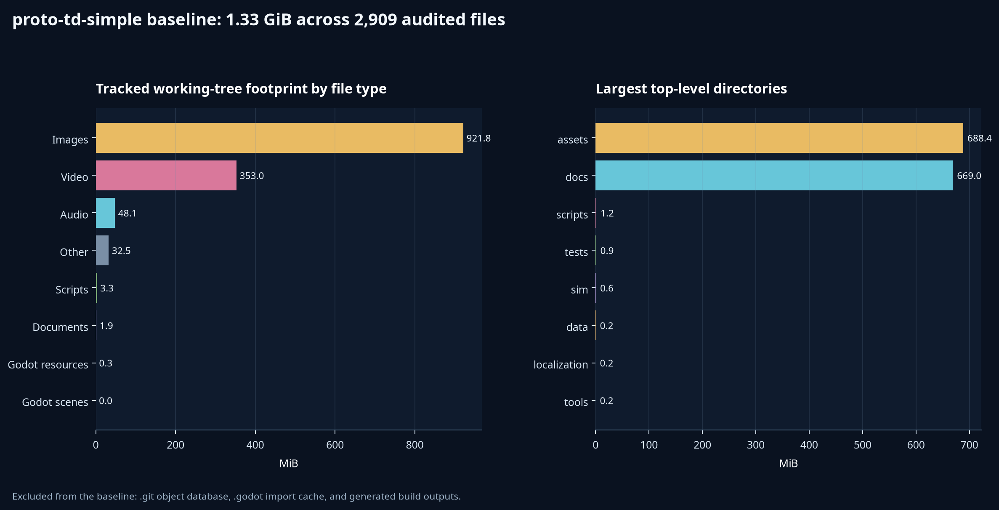

# Proto TD Simple: Game-Template Simplification Proposal and Implementation Plan

**Author:** Manus AI

**Repository:** `junnyboi/proto-td-simple`

**Audit revision:** `7e63722bab09af0c97fc0d42d588776e41e2c265` (`master`)

**Date:** 2026-08-31

**Status:** Proposed; no gameplay, asset, branch, or deployment removals have been executed

## Executive decision

`proto-td-simple` should become the isolated, forward-only template target. It should **not** be simplified by deleting half the files and negotiating with whatever remains at boot. The current game binds sixteen stages, P16/V3 persistence, premium/economy systems, broad content scans, generated manifests, deferred packs, cinematics, and presentation code into a coherent production application. Deleting assets first would leave a smaller repository and a larger fire.

The safe strategy is a **compact replacement architecture followed by reachability-led deletion**. The replacement preserves the strongest reusable engineering: deterministic integer-tick combat, ticket-bound outcomes, atomic compare-and-swap saves, persistent hero identity, resolution-owned XP, data-driven specialization, isolated `user://` tests, and a playable Web export. It then removes product systems only after their routes, schemas, manifests, tests, and resource references no longer exist.[1] [2] [3]

The recommended template is a complete two-stage tower-defense loop:

> **Title → Operations → Field Team → Battle → Results → Training → Operations**

Three fixed Recruit identities can enter Stage 1, surviving deployed heroes receive configured XP after a durable result commit, and one eligible hero can permanently specialize into **Defender** or **Gunner** without changing `hero_id`. Stage 2 is locked until Stage 1 is durably cleared and is balanced to make blocking and ranged Runner counterplay legible. The game must remain playable offline; a local-first leaderboard is an optional module, and the global board is a later integration phase with an explicit backend decision.

The working-tree audit measured **1.33 GiB across 2,909 files outside `.git`, `.godot`, and generated `build/` output**. The repository has 2,910 tracked paths, including `build/.gdignore`. Images account for 921.8 MiB and video for 353.0 MiB. Runtime `assets/` and reference-heavy `docs/` are each roughly 0.67 GiB.[4]

The main compliant media scenario—static character frames, no OGV video, one BGM, no generated variants or experimental salvage, while retaining backgrounds, foregrounds, portraits, fonts, VFX, and existing SFX—is estimated to remove approximately **627.3 MB from runtime source assets**, reducing the current 721.2 MB runtime-asset baseline to approximately **93.9 MB**. That is a planning estimate, not a release claim; the final export size must be measured from the actual candidate after Godot import and Web export.[4]

## Proposed template contract

| Concern | Template contract | Explicit exclusion |
|---|---|---|
| Playable content | Two stages (`s1`, simplified `s2`), one path each, one to three selected heroes, Grunt and Runner enemies | Stages `s3`–`s16`, Act II, restoration lattice, high-threat missions, narrative campaign |
| Persistent roster | Three fixed adult Recruit hero IDs | Recruitment, paid hires, rarity, premium heroes, custom names/titles, roster sorting |
| Specialization | Recruit → Defender or Gunner at configured XP; one permanent class change with stable `hero_id` | Advanced class trees, entitlements, gacha unlocks, second promotions |
| Tactical verbs | Deploy, pause/resume, resign; retreat may be retained only if Stage 2 teaches it | Skills, spells, traps, healing, charm, Slow Field, active cooldown stacks |
| Campaign authority | Frozen attempt ticket → deterministic battle → sealed outcome → atomic state commit → projected Results | UI-awarded rewards, unticketed campaign battles, save mutation from presentation code |
| Progression | Stage Stars, S1→S2 unlock, survivor XP, promotion receipt | Marks economy, pity, offers, replay stipend, permanent death, memorial/honor |
| UI | Title, Operations, Field Team, Battle/HUD, Results, Training, pause/resign modal | Loading hub, staging command center, gacha, Vahalla, archive, cutscene players |
| Art | Static directional character images plus procedural transforms; basic terrain/world/portraits/VFX | Runtime character atlases, generated enemy variants, experimental salvage, animated title/video |
| Audio | One newly generated generic template BGM and all existing SFX | Stage/intensity/boss/result BGM matrix, cinematic ambience, narrative logs |
| Configuration | Validated `TemplateConfig` plus a developer tuning panel and sandbox sync command | Gameplay constants in UI scripts, broad directory scans, hidden host arguments |
| Leaderboard | Separate local-first profile; optional global HTTP client; campaign never depends on network | Leaderboard data in canonical campaign saves, client secrets, claims of competitive anti-cheat |
| Distribution | Local Web export, one-command quality gate, CI, release manifest, GitHub template setting | Mandatory external PCK packs, cinematic CDN, hard-coded WebDev host/checkpoints |

### Why two stages rather than eight

Reducing sixteen stages by exactly half would still retain eight sets of balance, art, narrative, music, localization, unlock, and test obligations. That is a smaller product, not a reusable starter. **Two stages are the minimum coherent proof**: S1 teaches the loop and unlocks promotion; S2 proves the promoted class affects play. The registry must also accept a one-stage smoke configuration, but the shipped example should include two.

### Canonical class closure

The existing Recruit resource offers five promotion destinations. The existing Defender maps to operator `defender_1`, while the existing Gunner maps to operator `sniper_1`; both operator resources currently include skill dependencies that are outside the template boundary.[5]

The compact data model should expose only these public class IDs:

| Class ID | Initial operator source | Role | Template adjustment |
|---|---|---|---|
| `recruit` | `recruit` | Cheap block-1 starter | Remove extra promotion edges; target only Defender/Gunner |
| `defender` | simplified derivative of `defender_1` | Ground lane anchor, block 2–3, high HP | Remove active skill and advanced promotion edge |
| `gunner` | simplified derivative of `sniper_1` | Elevated ranged Runner counter | Retain role under `gunner`; remove active skill and advanced promotion edge |

The public schema must use the class-role contract rather than leaking `sniper_1` or legacy advanced names into saves. Asset IDs may remain internal aliases until static replacements are accepted.

## Current-state audit

### Repository and infrastructure baseline

| Area | Audited state | Template implication |
|---|---:|---|
| Tracked paths | 2,910 | Too broad for a starter; generated evidence and product histories dominate discoverability |
| Audited working-tree payload | 1.33 GiB / 2,909 files excluding `.git`, `.godot`, and `build/` | Current clone surface is not lightweight |
| Git object database | Approximately 1.98 GiB | Do not rewrite `master`; use GitHub’s template mechanism so generated repositories start with one commit |
| Scenes | 36 `.tscn` files; 11 product root screens observed | Collapse active journey to six screens |
| Gameplay resources | 166 `.tres`/`.res`; 16 stage definitions | Use an explicit two-stage registry and compact resource closure |
| Scripts | 321 GDScript files; 73 scripts in `sim/` | Preserve deterministic kernel; replace P16 campaign stack and product presentation |
| Tests and harnesses | 90 `tests/` SceneTree tests, 33 `test/` GDScript harnesses, 19 harness scenes | Retain approximately 10–14 high-value tests plus three template infrastructure tests |
| Localization | 1,048 keys per English/Chinese catalog | Generate a paired active-key catalog of approximately 60–90 entries |
| CI | No `.github/workflows/` | Add pinned Godot CI and one local command before template release |
| Remote branches | 101 heads: `master`, 90 merged non-default heads, 10 unmerged heads | Branch cleanup is a separate archival/governance operation, never a gameplay-deletion shortcut |

The remote classification is recorded in `docs/template-simplification/remote-branch-status.tsv`. Ten unmerged branches contain unique historical work and must be tagged or bundled before any eventual remote-ref deletion. Ninety merged non-default heads can enter a grace-period cleanup after links and retention needs are checked. `master` must remain forward-only and must never be rebased, filtered, or force-pushed.[6]

### Media footprint

| Family | Measured source footprint | Disposition |
|---|---:|---|
| Runtime `assets/` | 721.2 MB excluding import/UID metadata | Reduce only after replacement manifests and routes are active |
| Operator animation directory | 271.6 MB across 296 sheets | Convert retained identities to first-cell directional sprites, then remove sheets |
| All OGV video | 270.2 MB | Remove title, mission, and gacha video dependencies and files |
| Mission/gacha cinematic tree | 245.6 MB including posters/audio/metadata | Remove the subsystem; retain only generic static art if reused |
| Generated enemy variants | 40.4 MB | Remove after `Art` no longer loads the variant manifest |
| Experimental salvage | 17.3 MB | Remove after `Art` and schema tests stop requiring its manifest |
| Music | 27.1 MB | Replace with one generated template loop; remove the old catalog matrix |
| Existing SFX | 6.2 MB across 20 WAV files | Retain all as requested; unused gacha cues may be relabelled as sample/UI stingers |
| Basic VFX | 1.27 MB | Retain; procedural particles already provide high value at low cost |
| Documentation/reference media | 701.4 MB total; 447.7 MB strong archive candidates | Archive with checksums and provenance; `docs/.gdignore` means this does not change export size |

The project already proves the desired static-sprite method: eight production enemies use one-frame textures while `EnemyAnimator` supplies bob, roll, squash, lunge, flash, dissolve, and particle effects procedurally.[7] Operator animation still assumes continuous atlas frame lookup, so static conversion requires changing `OperatorAnimator` to clamp to frame zero and drive visual transforms instead of merely deleting atlases.[8]

### Campaign and save coupling

`CampaignRuntimeContext` scans broad stage/class/operator/trap/spell catalogs, and the V3 codec validates fixed P16 structures and a full content environment. Deleting stage or class resources first will break fresh startup or restore.[3] The current `CampaignSaveStore` and runtime authority, however, contain excellent reusable semantics: expected-preimage compare-and-swap, temp/backup recovery, independent validation, retryable prospective mutations, and publish-after-save.[9] [10]

The template should therefore use a **new save schema and namespace**, not trim `CampaignStateV3.DATA_KEYS` in place. The minimum state is:

| State group | Required fields |
|---|---|
| Identity | `schema_version`, `campaign_uid`, `seed`, `revision` |
| Progress | `stage_stars` for `s1`/`s2`, first-clear unlock state |
| Roster | Three rows containing `hero_id`, display identity, `class_id`, operator alias, XP, ready state |
| Attempt | Exactly one pending ticket with attempt ID, stage, seed, expected revision, and frozen hero/class/operator stats |
| Resolution | Last accepted result receipt with Stars, kills, leaks, terminal tick, XP rows, and newly unlocked stage |
| Promotion | Idempotent promotion receipt/command ID preserving the same `hero_id` |

The recommended default XP contract is the current, already understood policy: **clear 100, ordinary defeat 50, resign 0**, awarded only to selected, deployed, surviving heroes. These values move into `TemplateConfig` and remain resolution-owned.[1]

### Proto Scroller leaderboard audit

`proto-scroller` contains useful local-first patterns: separate bounded JSON persistence, deterministic ranking, callsign validation, explicit Local/Syncing/Online/Fallback states, request correlation, and timeout handling.[11] [12] Its current checkout does **not** contain the global service described by its historical plan: the Node server is static, the Web client has no leaderboard message receiver, and no database schema/migrations or Drizzle/tRPC/MySQL dependencies exist.[13]

Consequently, the TD template should reuse the pattern, not claim to port a missing backend. An anonymous client-reported board is a community feature, not authoritative anti-cheat. A locally valid battle hash cannot prove honesty to a remote server controlled by the same client.

## Simplification procedure

### 1. Replace broad content discovery with an explicit template registry

Add a `TemplateConfig`/registry that owns stage order, allowed classes/operators/enemies, starter heroes, squad cap, XP policy, promotion targets, BGM ID, leaderboard settings, and UI identity. The game must never infer the template’s active content by scanning whole directories. This registry is the prerequisite for deleting any unused `.tres` resource.

The recommended canonical authoring form is `data/template/template_config.json` with a strict GDScript validator and schema version. Tactical values that already fit `data/config/game.tres` may remain there; the template file references it and owns the campaign shell.

A developer-only **Tweak UI** should edit a validated override at `user://template_override.json`. A repository tool then performs explicit pull/push synchronization between that override and a sandbox working copy. Production builds read packaged config plus optional user override but never write to `res://`. For Web builds, the panel exports/imports JSON through a deliberate download/upload action; it does not pretend a browser can silently write to the sandbox.

### 2. Introduce the compact state before deleting P16

Create new template state, codec, store facade, attempt commands, and save namespace. Reuse or adapt the atomic save mechanics, but remove economy, gacha, memorial, offers, renaming, migration, and full-environment fields. The normal UI must never use the direct-battle fallback because it lacks persistent hero attribution.

Only three strategic commands remain:

1. `begin_attempt(expected_revision, stage_id, hero_ids)` freezes the selected roster into one ticket and saves before battle.
2. `resolve_attempt(expected_revision, sealed_outcome)` derives Stars, unlock, and XP exactly once and saves before publishing Results.
3. `confirm_promotion(expected_revision, hero_id, target_class_id)` validates the configured edge, retains `hero_id`, and saves once.

### 3. Reduce tactical systems vertically

A feature is removed only when its action, state, snapshot/hash fields, ticket fields, data resources, UI controls, VFX/audio calls, localization, and tests are removed together. Retain integer ticks, DP, deployment, fixed-point movement, blocking, attacks, leaks, Stars, terminal result, and resign. Remove skills, traps, spells, healing, charm, Slow Field, restoration, and cooldown stacks.

Before certifying the reduced deterministic core, fix two audit findings: equal-tick wave entries need an explicit authored ordinal, and the battle hash must include next enemy/unit IDs and canonical textual identifiers.[14] The view can animate freely, but model actions are tick-stamped and the model owns all outcomes.

### 4. Ship two deliberately small stages

| Stage | Purpose | Minimal content | Success proof |
|---|---|---|---|
| S1 — First Stand | Placement, DP, block, leak, survivor XP | One path, 6–8 deploy cells, one elevated cell, no more than six Grunts, leak limit 3 | Clear gives configured survivor XP and durably unlocks S2 |
| S2 — Tempo Check | Demonstrate Defender/Gunner choice | One path with a meaningful choke and ranged approach; Grunts plus Runners; squad cap 3 | Either role has a credible winning plan; unspecialized play is meaningfully harder |

Stage 2 should not retain Shieldbearer, Caster, spell, premium, or four-unit recovery assumptions. Balance tests use ticketed heroes and deterministic action logs rather than UI frame timing.

### 5. Collapse the UI to one screen per decision

Keep the existing scene paths when useful for automation, but rewrite their controllers around the compact API.

| Screen | Keep | Remove |
|---|---|---|
| Title | Logo/background, Start/Continue, locale, Tweak UI, Leaderboard | Animated video, prefetch, product settings matrix, loading bridge |
| Operations | Two stage cards, lock state, objective, Stars, Back | Staging hub, dossier, Act II ornament, cutscene gate, economy rewards |
| Field Team | Three fixed hero cards, select 1–3, class/XP, Start | Hire, currency, filters, sort, drag order, premium/fallen states, rename |
| Battle | Map, units/enemies, core/DP/wave/kills HUD, deploy, pause/resume, resign | Spell/trap bars, narrative dialogue, cinematics, Act II, restoration, complex overlays |
| Results | Clear/defeat, Stars, kills/leaks, committed XP rows, Retry/Next/Training/Operations | Currency, memorial, premium loss, narrative ledger, reveal ceremony |
| Training | One eligible hero, XP meter, Defender/Gunner choice, commit/retry | Full roster workspace, advanced paths, names/titles, entitlements |

Keep the paired English and Simplified Chinese localization seam, but generate both catalogs from one active-key manifest and remove deleted feature families together. Pause handling must continue to consume Space so a focused `ui_accept` control cannot activate and pause on the same input.

### 6. Convert animated art before deleting atlases

For each retained character identity and facing direction, extract the manifest-defined first cell at the correct pivot. Do not crop a whole sheet heuristically. Preserve one transparent source image per direction, downscale runtime art consistently, and retain visual IDs through manifest aliases until all scenes are migrated.

Procedural animation is visual-only and must not alter model timing:

| State | Transform recipe | Authority rule |
|---|---|---|
| Idle | 1–2% vertical sine bob, tiny rotation, shadow squash | Driven by presentation time; no gameplay state mutation |
| Move/deploy | Short parabolic hop and landing squash | Triggered from projected position/deploy events |
| Attack | Anticipation squash, directional lunge, overshoot return | Starts from model attack event/tick but never changes attack timing |
| Hit | Brief palette/white flash and 2–4 px recoil | Presentation response only |
| Defeat/despawn | Scale/fade plus retained particles | Model already decided removal |

Keep two operator animation profiles only if required for role readability; otherwise one generic profile with tunable amplitude/duration is sufficient. Convert Grunt the same way. Runner and other retained static enemies already fit the model.[7]

The title video is replaced by a static image. Prefer its first decodable frame if it is visually complete; if frame zero is a codec fade/blank, use the existing static fallback and record the exception. All mission and gacha video players, stream catalogs, prefetch services, hashes, and media are removed rather than left in dormant poster mode.

### 7. Simplify audio deliberately

Generate a new, generic template BGM with the built-in **Lyria 3 Pro** music tool during implementation. It should be a seamless 60–90 second tactical-fantasy loop with restrained intro, readable midrange, no vocals, and enough neutrality for Title, Operations, Battle, Results, and Training. Preserve the highest-quality source outside runtime Git and commit one normalized OGG loop plus its provenance record. Read the music prompting skill immediately before generation.

All existing SFX remain available. Product-specific gacha cues can be relabelled as optional sample/reward stingers so this requirement does not conflict with removing gacha gameplay. No new SFX integration is required for the first template because the existing library is sufficient.

For future authoring, two supported routes should exist. A deterministic Godot-side generator can render elementary UI bleeps, impacts, clicks, and alerts into `AudioStreamWAV`/WAV assets from parameter presets. An optional ElevenLabs authoring connector may later generate richer SFX, but it must be an editor/agent tool, not a runtime dependency; the current session has disabled ElevenLabs connectors, so capability and authorization must be verified before that path is implemented.

### 8. Remove unreachable systems and assets in measured batches

Deletion is last. Each batch first updates the route map, autoload list, registry, resource preloads, `Art` manifests, music/cinematic catalogs, export filters, localization manifest, and tests. It then runs a clean import, focused headless tests, static reference scan, and Web export before `git rm` removes assets and committed import metadata.

| Batch | Architecture change first | Then remove |
|---|---|---|
| Campaign | Compact registry/state/commands active | P16 campaign resources, legacy migration, economy, gacha, premium, recruitment, memorial/honor, naming |
| Stages | Registry contains only S1/S2 | `data/stages/s3.tres`–`s16.tres`, narrative counterparts, Act II themes/assets/tests |
| Tactical extras | Reduced BattleModel/ticket/snapshot/hash and HUD compile | Skills, spells, traps, Slow Field, restoration, healing/charm data/code/UI/tests |
| Screens | Six-route `Game` coordinator active | Loading, staging, gacha, Vahalla, archive, cutscene controllers/scenes/autoloads |
| Characters | One-frame manifests and procedural animator accepted | Retired operator/Grunt atlases and eleven content-pack routes |
| Video | Static title and direct stage transition active | Title/mission/gacha OGV, cinematic audio, prefetch/stream manifests and staging tools |
| Music | Every requested music state resolves to one loop | All old music tracks and intensity/boss/result routing |
| Deprecated art | `Art` loads one compact manifest | Enemy variant and experimental salvage files/manifests/tests |
| Documentation | External archive manifest and consumer migration complete | Product source/verification media and historical release records from template default branch |

## Leaderboard proposal

### Local-first template module

Leaderboard persistence must remain separate from campaign integrity at `user://leaderboard_profile.json`. A failed local write or network request must never roll back, delay, or duplicate a campaign resolution.

| Component | Responsibility |
|---|---|
| `LeaderboardTypes.gd` | Versioned entry/profile/submission validation and bounds |
| `LeaderboardStore.gd` | Anonymous installation ID, display name, bounded per-board best/history, atomic save, bounded upload outbox |
| `LeaderboardEligibility.gd` | Pure adapter from a durably accepted TD outcome to an eligible record |
| `LeaderboardClient.gd` | Small refresh/submit interface |
| `NullLeaderboardClient.gd` | Default disabled/offline behavior with immediate status |
| `HttpLeaderboardClient.gd` | Optional HTTPS JSON client with timeout, size caps, URL allowlist, correlation, and response validation |
| `LeaderboardService.gd` | Local-first record, optional async submit/retry, snapshots/status signals |
| `LeaderboardPanel.tscn` | Skinnable Local/Global panel with Local, Syncing, Online, Offline, Disabled, and Unranked states |

The smallest honest TD board is scoped by **stage ID plus balance revision**. Only accepted campaign clears qualify. Sort by **Stars descending, leaks ascending, terminal tick ascending, then earliest server record ID**. Kills are descriptive metadata until the game defines a canonical score. Direct/test battles, resigns, defeats, development builds, and uncommitted outcomes are ineligible.

### Global backend options

Automation guidance requires the backend choice to remain explicit because it changes hosting, secrets, maintenance, privacy, and incident response. The implementation plan should not silently pick one on behalf of the project.

| Option | Architecture | Best fit | Trade-offs |
|---|---|---|---|
| Cloudflare Worker + D1 | Godot HTTPS client → versioned Worker REST API → indexed D1 tables | Small anonymous community board with low operational overhead | Requires Worker deployment, migrations, CORS, rate limiting, moderation, secret pepper, retention, and D1 query/load validation |
| Supabase Postgres + Edge Function | Godot HTTPS client → Edge Function → server-only Postgres upsert/ranking | Future accounts, dashboards, richer ranking, operational visibility | More platform-specific configuration; RLS and service-role boundaries must be exact; still client-reported |
| Existing WebDev/Node host + managed SQL | Add an API and migrations to the separate host repository; direct REST for Web/native | A project that wants one fully controlled host/backend stack | Highest maintenance and deployment coupling; current source does not contain this backend; native cannot depend on an iframe bridge |

All options initially expose only `GET /v1/boards/{board_id}` and idempotent `POST /v1/boards/{board_id}/entries`. The server owns timestamps, allowlists board revisions, caps fields and rows, rate-limits submissions, hashes the raw installation ID with a server-only pepper, and stores only the best record per installation/board. No secret ships in Godot. The global feature remains explicitly **community-ranked** until server-issued attempts and replay/server simulation verification exist.

A backend selection is required before the global phase. Local-first storage, DTOs, null client, UI states, and contract tests can be built without that decision.

## Infrastructure and branch simplification

### Template release infrastructure

The template should add:

| Artifact | Purpose |
|---|---|
| `scripts/test.sh` | One local command running import, compact headless suite, and optional Web smoke through isolated `user://` wrappers |
| `.github/workflows/godot.yml` | Pin exact Godot 4.7.2, run static/import/tests, upload failure logs |
| `tests/smoke_boot.gd` | Boot and clean exit |
| `tests/save_isolation.gd` | Prove tests never touch playable user data |
| `tests/manifest_contract.gd` | Validate the compact asset manifest |
| `tools/release_manifest.py` | Record source SHA, Godot version, export files, bytes, and SHA-256 |
| `docs/DEVELOPMENT.md` / `docs/RELEASE.md` | Concise run, tweak, test, export, rollback, and optional leaderboard/backend contracts |

Godot 4.7.2 and matching export templates remain pinned because the source project declares that compatible patch. The generic template must export locally without external PCKs, OGV streams, or Manus WebDev arguments. Optional content streaming can be preserved later as a separate example module, not inherited by every generated game.[15]

### Remote branches

Remote branch deletion is a separate, potentially destructive governance task and is **not authorized by this proposal**. The implementation should first create a dated branch ledger and immutable archive tags/bundles for the ten unmerged tips. Merged non-default heads receive a 30-day grace period; art, release, or persistence heads receive 90 days. After owner/reference review, only the branch refs may be deleted. No shared history is rewritten.

Once the default branch is lean and validated, enable GitHub’s **Template repository** setting. GitHub-generated repositories inherit the default branch’s files but begin with a single unrelated commit, avoiding this repository’s large historical object database. Consumers should not select “include all branches”; all-branch generation would copy obsolete work lanes into new projects. GitHub also notes that template repositories cannot include Git LFS files; the audited repository does not use LFS.[16] [17]

## Dependency-ordered implementation plan

The phases below are designed as reviewable, forward-only commits on `proto-td-simple/master`. Each phase has one focused gate and is merged only when its replacement boundary is operational. Do not batch destructive deletions with state-authority work.

| Phase | Work package | Exit gate | Relative risk |
|---:|---|---|---|
| 0 | Tag the audited baseline; write retention/removal ledger; archive the ten unmerged branch tips without deleting refs; confirm exact Godot 4.7.2 bootstrap | Clean synchronized master, baseline tag, archive ledger, bounded boot | Low |
| 1 | Add characterization tests for replay, same-tick order, hash counters, ticket/outcome, save CAS retry, XP 100/50/0, promotion identity, S1 unlock | Tests detect injected failures and run through unique disposable `user://` | Medium |
| 2 | Add `TemplateConfig`, explicit content registry, active localization manifest, validator, and developer Tweak UI/sandbox sync contract | One-stage and two-stage fixtures validate; no template content comes from directory scans | Medium |
| 3 | Implement compact state/codec/save namespace and begin/resolve/promote commands by adapting durable authority patterns | Fault/retry/reload produces exactly one receipt, XP award, unlock, and promotion | High |
| 4 | Reduce tactical action/state families; add authored wave ordinal and counter-inclusive canonical hash | Identical ticket/action log yields identical terminal outcome/hash; illegal actions are non-mutating | High |
| 5 | Re-author S1/S2 and Recruit/Defender/Gunner resources without skills; tune deterministic reference plans | S1 clear unlocks S2; stable-ID promotion survives restart; S2 demonstrates both roles | High |
| 6 | Rewrite the six UI controllers and thin `Game` router; remove product routes/autoloads; prune paired locale catalogs | Title-to-S2 loop passes in English/Chinese; pause/resign/input and result gate pass | High |
| 7 | Extract accepted first-frame directional art; implement procedural animator; replace title video; generate one Lyria BGM; collapse audio routing | Landscape/portrait visual matrix passes; no blank frames, pivot drift, chroma residue, or missing audio IDs | Medium |
| 8 | Run static reachability and delete S3–S16, product systems, dead data, animation/video/music/deprecated assets, obsolete tests/tools/docs | Clean import, compact test suite, no removed-path references, local Web export; record actual byte/hash delta | High |
| 9 | Implement local leaderboard module, panel, post-commit eligibility hook, null HTTP client, and contract tests | Offline/local board survives restart and never changes campaign bytes or blocks Results | Medium |
| 10 | After backend selection, implement and deploy one global backend plus HTTP client/outbox, privacy/abuse/operations controls, and E2E tests | Web/native submit and refresh work; outage remains local-first; no secrets in export; rollback tested | High |
| 11 | Add CI, release manifest, concise template docs, fresh-clone verification; enable GitHub template setting; save WebDev checkpoint only if a host deployment is requested | Fresh generated repository boots/tests/exports from one default-branch commit | Medium |

### Commit boundaries

Recommended commits are: `test: characterize compact template invariants`; `feat: add explicit template content contract`; `feat: add compact campaign authority`; `refactor: reduce deterministic battle kernel`; `feat: author two-stage specialization loop`; `refactor: replace product UI with template shell`; `feat: convert runtime presentation to static procedural assets`; `chore: prune unreachable product systems and media`; `feat: add local leaderboard module`; `feat: add selected global leaderboard backend`; and `ci: ship reproducible template release gate`.

Each commit remains bisectable. The destructive media commit must not also change save or battle authority.

## Acceptance matrix

| Area | Automated evidence | Observable evidence |
|---|---|---|
| Startup | Headless boot; route/preload denylist | Title opens without missing-resource errors |
| Two-stage progression | Fresh/clear/reload test | S2 disabled before S1 and enabled afterward |
| Determinism | Replay, same-tick ordinal, target ties, hash paranoia | Logged identical hashes for two runs |
| Persistence | CAS fault, retry, corruption recovery, duplicate command tests | Results unavailable until save succeeds; retry recovers |
| XP and specialization | Clear/defeat/resign, undeployed/survivor, promotion identity tests | Results XP rows and Training choice match committed receipt |
| Battle UI | Legal deployment, HUD projection, pause/resign, Space/controller tests | S1/S2 landscape and portrait captures |
| Localization | Generated active-key parity and placeholder tests | English/Chinese captures at 1280×720, 720×1280, 540×960 |
| Static art | Manifest frames=1, texture lookup, pivot/root, procedural profile tests | No clipping, blank frame, jitter, or atlas/chroma artifact |
| Audio | One BGM catalog entry; all SFX IDs resolve | Loop is seamless; pause/resume and Web audio recovery work |
| Deletion closure | Resource reachability, clean import, removed-path denylist | No dead menu affordances or placeholder assets |
| Local leaderboard | Atomic profile, bounds, ranking ties, dedupe, reset, offline tests | Local/Disabled/Offline states are accurately labelled |
| Global leaderboard | API schema, migration, idempotency, CORS/rate limit/moderation, Web/native E2E | Cross-client rank refresh; service outage does not block play |
| Release | CI, exact artifact bytes/SHA, MIME smoke, fresh generated repo | One-command local Web export and clean managed-browser console if deployed |

## Definition of done

The simplification is complete when a new repository generated from `proto-td-simple` can be cloned without historical product branches, opened with Godot 4.7.2, and run without external media or host configuration. A fresh player can start, select heroes, clear S1, receive one durable XP award, specialize the same hero, unlock and play S2, pause/resume/resign safely, view committed Results, restart and retain progress, edit validated template configuration, and use a local leaderboard offline. The selected global backend must be separately deployed and verifiably fail soft.

The candidate must contain no reachable gacha, premium, permanent-death, memorial, Marks economy, archive, cinematic, content-pack, S3–S16, Act II, skill/spell/trap, or legacy P16 save path. Runtime assets should be measured near the projected 94 MB range, but the release criterion is the **actual exported artifact and manifest**, not the estimate. One final checkpoint and publish are required only when deployment is requested.

## Approval decisions before implementation

The plan can begin with characterization and configuration work immediately after approval, but three material choices must be explicit before their phases:

| Decision | Proposed default | Needed by |
|---|---|---|
| Stage count | Ship S1 and S2; support one-stage config | Phase 2 |
| Class closure | Recruit → Defender or Gunner; no active skills | Phase 2 |
| Global backend | Select Cloudflare+D1, Supabase, or external WebDev/Node+SQL after comparing project operations requirements | Phase 10 |

## References

[1]: https://github.com/junnyboi/proto-td-simple/blob/7e63722bab09af0c97fc0d42d588776e41e2c265/sim/battle_model.gd "Proto TD deterministic battle model"

[2]: https://github.com/junnyboi/proto-td-simple/blob/7e63722bab09af0c97fc0d42d588776e41e2c265/autoloads/game.gd "Proto TD game and campaign transition coordinator"

[3]: https://github.com/junnyboi/proto-td-simple/blob/7e63722bab09af0c97fc0d42d588776e41e2c265/sim/campaign_runtime_context.gd "Proto TD campaign runtime content binding"

[4]: https://github.com/junnyboi/proto-td-simple/blob/master/docs/template-simplification/repository-inventory.json "Proto TD Simple reproducible repository inventory"

[5]: https://github.com/junnyboi/proto-td-simple/tree/7e63722bab09af0c97fc0d42d588776e41e2c265/data/classes "Proto TD class resources"

[6]: https://github.com/junnyboi/proto-td-simple/blob/master/docs/template-simplification/remote-branch-status.tsv "Proto TD Simple remote branch merge-status ledger"

[7]: https://github.com/junnyboi/proto-td-simple/blob/7e63722bab09af0c97fc0d42d588776e41e2c265/scripts/view/enemy_animator.gd "Proto TD static enemy procedural animation"

[8]: https://github.com/junnyboi/proto-td-simple/blob/7e63722bab09af0c97fc0d42d588776e41e2c265/scripts/view/operator_animator.gd "Proto TD operator atlas animation"

[9]: https://github.com/junnyboi/proto-td-simple/blob/7e63722bab09af0c97fc0d42d588776e41e2c265/sim/campaign_save_store.gd "Proto TD atomic campaign save store"

[10]: https://github.com/junnyboi/proto-td-simple/blob/7e63722bab09af0c97fc0d42d588776e41e2c265/sim/campaign_runtime_authority.gd "Proto TD durable campaign runtime authority"

[11]: https://github.com/junnyboi/proto-scroller/blob/cafdfd22644621c611ad5cd57a842802830a4d52/game/scripts/rampage/player_combat_profile_store.gd "Proto Scroller local combat profile and leaderboard store"

[12]: https://github.com/junnyboi/proto-scroller/blob/cafdfd22644621c611ad5cd57a842802830a4d52/game/scripts/network/leaderboard_bridge.gd "Proto Scroller asynchronous leaderboard bridge"

[13]: https://github.com/junnyboi/proto-scroller/blob/cafdfd22644621c611ad5cd57a842802830a4d52/server/index.ts "Proto Scroller current static server"

[14]: https://github.com/junnyboi/proto-td-simple/blob/7e63722bab09af0c97fc0d42d588776e41e2c265/sim/battle_hash.gd "Proto TD battle state hash"

[15]: https://github.com/junnyboi/proto-td-simple/blob/7e63722bab09af0c97fc0d42d588776e41e2c265/export_presets.cfg "Proto TD Web export preset"

[16]: https://docs.github.com/en/repositories/creating-and-managing-repositories/creating-a-template-repository "GitHub Docs: Creating a template repository"

[17]: https://docs.github.com/en/repositories/creating-and-managing-repositories/creating-a-repository-from-a-template "GitHub Docs: Creating a repository from a template"
